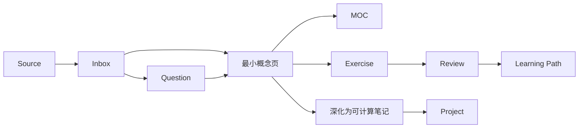

# 知识库架构 V2

本知识库使用 **文件夹 + MOC + Properties + Bases + 学习路径 + 问题/练习** 共同组织数学知识。

本页回答“内容放在哪里”；关于“为什么这样设计、何时拆分概念页以及新术语如何逐步完善”，见 [[知识库设计原则]]。

## 目录职责

| 目录 | 职责 |
|---|---|
| `00 Inbox/` | 尚未整理的输入和临时记录 |
| `05 Meta/` | 架构、设计原则、元数据和书写规范 |
| `10 Maps/` | MOC、索引和导航 |
| `15 Bases/` | Obsidian 原生动态视图 |
| `20 Concepts/` | 一概念一笔记的正式知识页 |
| `30 Learning Paths/` | 可执行的学习路线和验收顺序 |
| `40 Questions/` | 问题驱动笔记 |
| `50 Exercises/` | 练习、证明和计算 |
| `60 Projects/` | 数学与工程应用 |
| `70 Sources/` | 教材、论文和文章的来源笔记 |
| `80 Reviews/` | 周期复盘 |
| `90 Templates/` | 统一模板 |

## 五类内容层

1. **输入层**：来源笔记和 Inbox 保存尚未整理的信息。
2. **概念层**：正式概念页给出定义、动机、例子和关系。
3. **关系层**：MOC、学习路径和双向链接表达知识结构。
4. **实践层**：问题、练习和项目检验理解。
5. **查询层**：Properties 和 Bases 提供动态筛选。

## 为什么文件夹不是学习顺序？

同一个概念可能服务于多个主题。例如 [[欧氏空间与欧氏坐标]] 既是多元微积分的基础，也是流形、优化和数值计算的前置知识。

因此：

- 文件夹负责稳定归档；
- MOC 负责主题关系；
- 学习路径负责先后顺序；
- 双向链接负责跨主题复用。

## 核心原则

- 文件夹不代表严格学习顺序，学习顺序由学习路径表达。
- 一篇正式概念笔记只围绕一个主要概念。
- 新概念首次出现时必须有最小解释或链接。
- 对象、坐标和表示应明确区分。
- MOC 表达关系，不复制概念正文。
- 状态描述理解成熟度或工作流状态。
- 外部材料先建立来源笔记，再由概念笔记引用。
- 数学公式遵循 [[数学书写规范]]。
- 核心架构不依赖 Dataview 等第三方插件。
- 同名正式笔记只保留一个，避免链接指向空白页。

## 内容流

## 概念成熟度

概念页可以逐步升级，而不要求首次创建就成为完整教材：

1. **初见**：有最小定义和当前用途；
2. **可复述**：能解释动机、定义、例子和常见误解；
3. **可计算**：包含公式推导、坐标计算或练习；
4. **可应用**：能用于证明、建模、算法或项目。

具体规则见 [[知识库设计原则]] 和 [[笔记生命周期]]。

## 升级状态

- [x] 统一目录职责
- [x] 统一元数据模式
- [x] 建立原生 Bases
- [x] 统一数学公式分隔符
- [x] 建立知识库设计原则
- [x] 建立新概念首次出现规则
- [ ] 持续补充例子、反例、证明和应用
- [ ] 持续检查同名空白页和失效链接

## 相关规范

- [[知识库设计原则]]
- [[元数据规范]]
- [[笔记生命周期]]
- [[数学书写规范]]
- [[知识库系统 MOC]]
