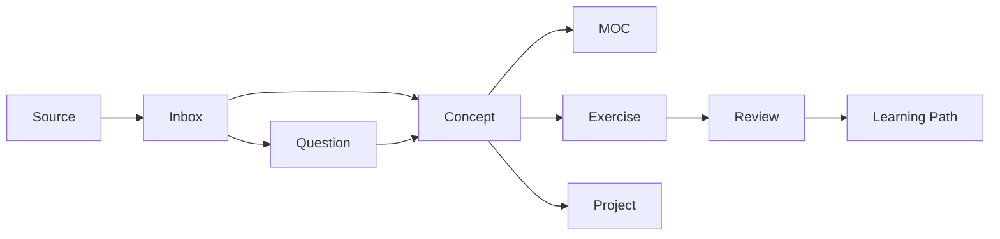

# 知识库架构 V2

本知识库使用 **文件夹 + MOC + Properties + Bases + 学习路径 + 问题/练习** 共同组织数学知识。

## 目录职责

| 目录 | 职责 |
|---|---|
| `00 Inbox/` | 尚未整理的输入 |
| `05 Meta/` | 架构、元数据和书写规范 |
| `10 Maps/` | MOC、索引和导航 |
| `15 Bases/` | Obsidian 原生动态视图 |
| `20 Concepts/` | 一概念一笔记 |
| `30 Learning Paths/` | 可执行的学习路线 |
| `40 Questions/` | 问题驱动笔记 |
| `50 Exercises/` | 练习、证明和计算 |
| `60 Projects/` | 数学与工程应用 |
| `70 Sources/` | 教材、论文和文章的来源笔记 |
| `80 Reviews/` | 周期复盘 |
| `90 Templates/` | 统一模板 |

## 三层组织

1. **归档层**：文件夹负责稳定存放。
2. **关系层**：MOC、学习路径和双向链接表达知识结构。
3. **查询层**：Properties 和 Bases 提供动态筛选。

## 核心原则

- 文件夹不代表严格学习顺序，学习顺序由学习路径表达。
- 一篇正式概念笔记只围绕一个主要概念。
- MOC 表达关系，不复制概念正文。
- 状态描述理解成熟度或工作流状态。
- 外部材料先建立来源笔记，再由概念笔记引用。
- 数学公式遵循 [[数学书写规范]]。
- 核心架构不依赖 Dataview 等第三方插件。

## 内容流

## 升级状态

- [x] 统一目录职责
- [x] 统一元数据模式
- [x] 建立原生 Bases
- [x] 统一数学公式分隔符
- [ ] 持续补充例子、反例、证明和应用

## 相关规范

- [[元数据规范]]
- [[笔记生命周期]]
- [[数学书写规范]]
- [[知识库系统 MOC]]
