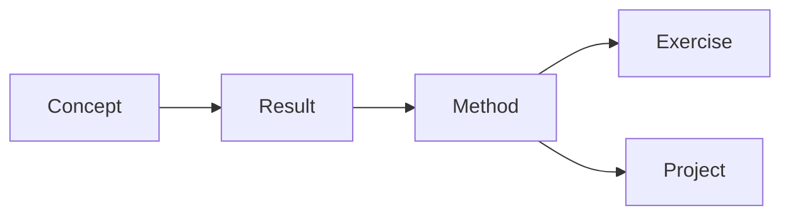

# 知识库设计原则

## 1. 目标

这个知识库不是把资料原样堆进文件夹，也不是只追求笔记数量。它的目标是把数学知识组织成一个可以逐步学习、反复验证并持续扩展的网络。

一篇笔记至少应回答一种问题：

- 这个概念是什么？
- 为什么需要它？
- 它与哪些概念有关？
- 如何计算或使用它？
- 哪些地方容易误解？
- 如何检验自己是否掌握？

## 2. 架构与设计原则的区别

[[知识库架构 V2|知识库架构 V2.1]] 说明内容放在哪里；本页说明为什么这样组织，以及新概念进入知识库时如何处理。

- **架构**：知识库的外部骨架；
- **设计原则**：内容进入骨架时遵循的规则。

## 3. 核心学习主线与支撑概念必须分开

学习路径不应把所有可能需要的基础知识都排成强制顺序。

### 核心学习主线

只包含当前主题内部不可跳过的概念链条。例如流形主题的核心主线是：

$$
\text{为什么需要流形}
\to
\text{拓扑流形}
\to
\text{坐标图与光滑结构}
\to
\text{切空间}
\to
\text{张量与微分形式}.
$$

### 支撑概念

用于解释正文中暂时陌生的对象，例如：

- [[20 Concepts/00 Foundations/欧氏空间与欧氏坐标|欧氏空间与欧氏坐标]]；
- [[20 Concepts/00 Foundations/约束变量与状态空间|约束变量与状态空间]]；
- [[20 Concepts/02 Geometry and Topology/圆周 S1|圆周 S1]]；
- [[20 Concepts/02 Geometry and Topology/球面 S2|球面 S2]]；
- [[20 Concepts/02 Geometry and Topology/特殊正交群 SO3|特殊正交群 SO3]]；
- [[20 Concepts/00 Foundations/向量空间与线性映射|向量空间与线性映射]]；
- [[20 Concepts/00 Foundations/多元链式法则与Jacobian|多元链式法则与Jacobian]]。

这些页面应通过正文链接、术语索引或 MOC 的“按需查阅”区域访问，而不是统一塞进主题学习主线。

> [!important]
> “存在前置关系”不等于“必须先完整学完”。读者可以先沿主线前进，在真正遇到理解障碍时再跳转补充。

在 Properties 中进一步区分：

- `prerequisites`：硬前置。缺少它会导致当前定义、定理陈述或核心推导无法被正确理解；
- `helpful_prerequisites`：按需支撑。知道它会更容易，但不应阻塞主线。

学习路径的顺序优先服从硬前置；按需支撑通过正文链接、MOC 或“卡住时查”提供。

## 4. 一概念一页，但不追求无限拆分

正式概念笔记原则上围绕一个主要概念展开。拆分的目的不是增加文件数量，而是让一个概念能够：

1. 被多个主题复用；
2. 独立解释；
3. 独立深化；
4. 被精确链接。

### 何时值得单独成页？

满足以下任一条件时，通常值得建立独立页面：

- 不理解它会阻塞当前正文；
- 它会在后续多次出现；
- 它有独立定义、性质或例子；
- 它容易与相邻概念混淆；
- 它以后需要继续扩展。

### 何时不必单独成页？

以下内容通常不需要立即拆页：

- 只在一处出现的普通符号；
- 一句话即可解释且不会复用的记号；
- 尚未确认是否重要的零散术语；
- 当前公式中的临时变量名。

因此，“一概念一页”不是“一符号一页”。

## 5. 首次出现原则

新的数学对象第一次在正文出现时，应至少完成一种处理：

1. 在原文中给出一句足以继续阅读的解释；
2. 链接到已有概念页；
3. 若没有概念页，则建立一页最小解释。

如果这个对象是当前页面的核心概念，则不能只给直觉或用途，必须先给出明确的定义句。推荐顺序是：

1. 一句话直觉；
2. 明确定义；
3. 为什么需要这个定义；
4. 例子；
5. 等价定义、坐标表达或后续计算。

例如讲“切向量”时，应先说“切向量是什么”，再解释为什么抽象流形上需要用曲线等价类或方向导数来定义它。不能先连续使用“切向量”这个词，再把定义藏在后文。

例如正文出现

$$
S^1,\qquad S^2,\qquad SO(3)
$$

时，应分别链接到：

- [[20 Concepts/02 Geometry and Topology/圆周 S1|圆周 S1]]；
- [[20 Concepts/02 Geometry and Topology/球面 S2|球面 S2]]；
- [[20 Concepts/02 Geometry and Topology/特殊正交群 SO3|特殊正交群 SO3]]。

但这些链接不意味着它们都必须先于“为什么需要流形”学完；它们是读者按需展开的解释节点。

## 6. 最小概念页与渐进式完善

新概念不必第一次就写成完整教材。最小概念页可以只包含：

- 一句话理解；
- 正式定义；
- 一个最小例子；
- 与当前主题的关系；
- 后续需要补充的内容。

之后再逐步增加：

- 等价定义；
- 定理与证明；
- 反例；
- 坐标计算；
- 数值或工程应用；
- 练习与答案。

## 6.1 推荐写法：定义、例子、评论

概念页正文推荐采用“定义、例子、评论”的局部结构：

1. **定义**：先说明这个对象是什么，以及符号中的每个对象属于哪里；
2. **例子**：给一个最小例子，最好能直接代入定义；
3. **评论**：说明常见误解、为什么需要这个条件、和后续概念的关系。

如果一个页面包含一组成对概念，例如切空间/切丛、余切空间/余切丛、张量/张量场，应优先说明：

- 点处对象是什么；
- 全局对象如何由点处对象收集或光滑变化而来；
- 物理或几何动机是什么；
- 哪些正式细节会在后续页面展开。

## 7. 对象、表示与坐标必须区分

数学学习中常见的混乱来自把对象本身与它的表示混为一谈。例如：

- 几何点不是坐标列；
- 切向量不是某一组分量；
- 旋转不是某一个欧拉角三元组；
- 流形不是它在高维空间中的某一幅图像；
- 张量不是数组本身。

概念页应尽量明确区分：

1. **对象是什么**；
2. **选定表示后写成什么**；
3. **更换表示时如何变换**。

## 8. 先解释动机，再给形式定义

概念笔记通常按下面的顺序组织：

1. 为什么需要；
2. 一句话直觉；
3. 正式定义；
4. 最小例子；
5. 反例或边界情况；
6. 与前后概念的关系；
7. 自检问题。

形式定义不能省略，但也不应在没有问题背景时突然出现。

## 9. 来源、概念和学习路径分离

- `70 Sources/` 记录某本书、论文或文章说了什么；
- `20 Concepts/` 组织经过核对后的数学概念；
- `30 Learning Paths/` 只表达主题核心学习顺序；
- `10 Maps/` 同时展示主线与按需支撑链接。

来源文章的目录不应直接等于知识库目录。一篇来源可以拆成多个概念，一篇概念也可以由多个来源共同核对。

## 9.1 Concept、Result 与 Method 分离

随着知识库进入分析、代数、微分几何和 PDE 等领域，只用 Concept 承载全部数学内容会逐渐失真。因此 V2.1 区分三类正式数学对象：

- **Concept**：回答“这个对象、性质或结构是什么”；
- **Result**：回答“在什么假设下可以推出什么结论，以及为什么成立”；
- **Method**：回答“面对一类问题，如何系统地证明、计算或构造”。

### 什么时候定理值得独立成 Result？

满足以下任一条件时，优先独立：

- 会被多个概念页或后续定理反复引用；
- 假设本身需要逐项讨论；
- 证明路线具有独立学习价值；
- 定理有多个重要特例或应用；
- 学习成熟度需要单独追踪“会陈述、会证明、会应用”。

简单性质或只服务当前定义的一步推论，不必为了形式统一强行拆页。

### 什么时候方法值得独立成 Method？

一个方法应同时具有：

1. 明确的问题类型或输入；
2. 可复用的步骤；
3. 每一步背后的数学依据；
4. 明确的适用条件或失败情形；
5. 能跨多个例子或主题复用。

例如“由约束 Jacobian 求切空间”“局部到全局拼接”“能量估计”都比某一道题的单次计算更适合作为 Method。

这不是强制每个概念都必须有 Result 和 Method，而是当知识结构真的出现这三种对象时，不再把它们压缩进同一类页面。

## 10. MOC 负责导航，不复制正文

MOC 的职责是：

- 展示核心学习主线；
- 单独列出按需背景；
- 标出前后关系；
- 指向概念页；
- 暴露尚未完成的区域。

MOC 不应复制大段概念正文。

## 11. 学习主线必须可校验

当一组页面存在固定学习顺序时，不应只在正文里手工维护“下一步”。应把顺序写入属性：

- `track`：这页属于哪条学习主线；
- `order`：这页在主线中的排序；
- `prev`：主线中的上一页；
- `next`：主线中的下一页。

主线页负责解释为什么这样排序，属性负责保存顺序数据。正文导航优先用 [[90 Templates/导航块模板|导航块模板]] 从 `prev` 和 `next` 生成，避免手写漂移。

MOC 可以展示多个入口、按需背景和横向关系；固定顺序以 `track/order/prev/next` 为准。

例如拓扑预备使用 `track: topology-prep`，其顺序由 [[20 Concepts/01 Topology/拓扑|拓扑]] 说明，各页属性负责维持前后页一致。

脚本校验只作为备份：当怀疑导航漂移、批量调整主线或整理大范围页面时再运行；日常维护以 Templater 生成正文导航为主。

## 12. 所有正式文件必须从模板开始

为了避免以后再次出现属性缺失、导航字段不一致、正文链接漂移的问题，新建正式页面时默认从对应模板创建。

模板负责提供：

- 基础属性：`type`、`up`、`status`、`created`、`updated`、`tags`；
- 可选主线属性：`track`、`order`、`prev`、`next`；
- 类型专属属性：如概念页的 `prerequisites`、`related`、`sources`，来源页的 `author`、`year`、`produced_notes`；
- 正文骨架：定义、直觉、例子、误区、下一步等稳定栏目。

旧页面整理时，应先补齐模板字段，再继续扩展内容。没有参加固定学习主线的页面，`track/order/prev/next` 可以留空；留空本身表示“当前不是线性学习链条的一部分”。

## 13. 几何例子必须解释维数、约束和表示

对于几何对象，至少应回答：

- 它由什么集合定义？
- 它位于哪个环境空间？
- 它自身的维数是多少？
- 有哪些约束？
- 常用坐标是什么？
- 坐标是否全局有效？

| 对象 | 环境表示 | 自身维数 | 主要约束 |
|---|---:|---:|---|
| $S^1$ | $\mathbb R^2$ | 1 | $x^2+y^2=1$ |
| $S^2$ | $\mathbb R^3$ | 2 | $x^2+y^2+z^2=1$ |
| $SO(3)$ | $\mathbb R^{3\times3}$ | 3 | $R^TR=I,\det R=1$ |

## 14. 避免同名空白页

Obsidian 在链接目标未正确解析时，可能在 Inbox 中生成同名空文件。为避免链接跳到错误页面：

- 正式概念名称尽量唯一；
- 新建前先搜索是否已有同名文件；
- Inbox 中的临时页及时整理；
- 同名概念页只保留一个正式版本；
- MOC 链接指向正式概念页。

## 15. 当前案例：为什么需要流形

[[20 Concepts/02 Geometry and Topology/为什么需要流形|为什么需要流形]] 中会自然出现 $\mathbb R^n$、受约束变量、$S^1$、$S^2$ 和 $SO(3)$。

合理组织方式是：

- “为什么需要流形”仍作为主题主线入口；
- 正文给出足够继续阅读的最小解释；
- 对细节感兴趣或理解受阻时，通过链接跳到独立概念页；
- 这些基础页不再作为统一的强制阶段排在主线之前。

## 16. 内容质量检查

- [ ] 新符号首次出现时有解释或链接
- [ ] 当前页核心概念在开头已有明确定义
- [ ] 定义后至少有一个能代入定义的例子
- [ ] 点处对象与全局对象没有混用
- [ ] 核心主线与按需背景已区分
- [ ] `prerequisites` 中只有真正的硬依赖，软依赖已放入 `helpful_prerequisites`
- [ ] 固定学习主线已使用 `track/order/prev/next` 并与 `## 下一步` 一致
- [ ] 前置概念没有被无条件塞进主线
- [ ] 对象与坐标表示已区分
- [ ] 至少有一个具体例子
- [ ] 至少指出一个常见误解
- [ ] 说明与后续主题的联系
- [ ] 给出可执行的掌握标准
- [ ] 可复用定理是否应该独立为 Result 已检查
- [ ] 可复用证明/计算流程是否应该独立为 Method 已检查
- [ ] 没有与其他正式笔记重名

## 相关页面

- [[知识库架构 V2|知识库架构 V2.1]]
- [[元数据规范]]
- [[笔记生命周期]]
- [[数学书写规范]]
- [[10 Maps/知识库系统 MOC|知识库系统 MOC]]
