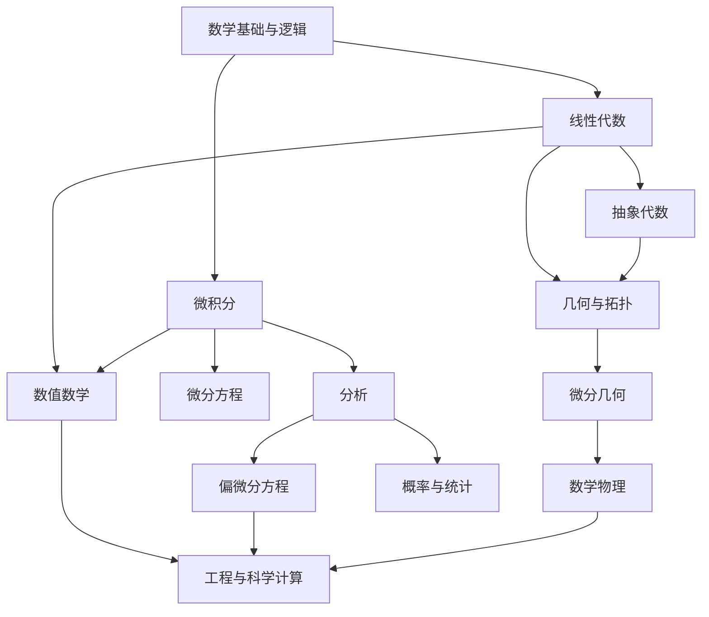

# 数学知识地图

## 基础支柱

- [[数学语言与逻辑 MOC]]
- [[线性代数 MOC]]
- [[微积分与分析 MOC]]

## 主要领域

- [[代数 MOC]]
- [[几何与拓扑 MOC]]
- [[概率与统计 MOC]]
- [[微分方程 MOC]]
- [[数值数学 MOC]]
- [[数学物理 MOC]]

## 当前已展开主线

- [[流形与微分几何 MOC]]

> [!note]
> 这张图表达“学习依赖”，不是严格的数学分类。很多主题之间存在双向联系。
