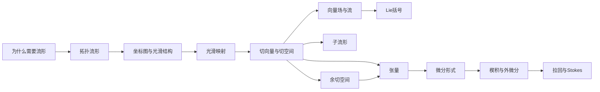

# 流形与微分几何 MOC

## 核心学习主线

> [!note]
> 下方“按需查阅”中的页面不是统一的前置阶段。沿主线阅读时，只有遇到陌生概念或需要更多细节，才跳转补充。

## 图示导航

- [[流形学习示意图规划]]：核心示意图的优先级、文件名和制作状态
- 图片统一存放于 `99 Assets/Images/Manifolds/`
- 图示只辅助空间直觉，正式定义与推导仍以概念页正文为准

## 按需查阅：基础对象与工具

### 欧氏空间、约束和典型例子

- [[欧氏空间与欧氏坐标]]
- [[约束变量与状态空间]]
- [[圆周 S1]]
- [[球面 S2]]
- [[特殊正交群 SO3]]

### 常用数学语言

- [[映射、复合与原像]]
- [[向量空间与线性映射]]
- [[对偶空间]]
- [[多元链式法则与Jacobian]]
- [[开集、连续与同胚]]

## 1. 动机与流形结构

- [[为什么需要流形]]
- [[拓扑流形]]
- [[坐标图、图册与坐标转换]]
- [[圆与球面的坐标图]]
- [[光滑流形]]
- [[光滑映射与微分同胚]]

## 2. 切空间、映射与子流形

- [[切向量]]
- [[切空间]]
- [[切丛]]
- [[推前与拉回]]
- [[浸入、淹没与嵌入]]
- [[子流形与正则值定理]]

## 3. 向量场

- [[向量场]]
- [[向量场的流]]
- [[Lie括号]]

## 4. 余切、张量与微分形式

- [[余切空间]]
- [[余切丛]]
- [[微分与梯度]]
- [[张量与张量场]]
- [[交替张量与微分形式]]
- [[楔积]]
- [[外微分]]
- [[微分形式的拉回]]
- [[流形上的积分与Stokes定理]]

## 5. 后续结构

待展开：

- 黎曼度规与体积形式
- 联络与协变导数
- 平行移动与测地线
- 曲率
- 分割统一
- de Rham 上同调
- 李群与李代数
- 辛几何

## 6. 力学与数值应用

- [[勒让德映射与切丛余切丛]]
- 约束动力系统
- 流形优化
- 李群积分
- 曲面 PDE
- 几何守恒律

## 练习

- [[前置知识练习]]
- [[切空间与余切空间练习]]
- [[流形基础与微分形式练习]]

## 关键问题

- [[为什么需要流形而不只使用约束方程]]
- [[为什么切向量与余切向量必须区分]]
- [[为什么不同点的切向量不能直接相减]]
- [[为什么微分天然属于余切空间]]
- [[为什么Lie括号不能只由单点向量决定]]
- [[为什么微分形式适合积分]]
