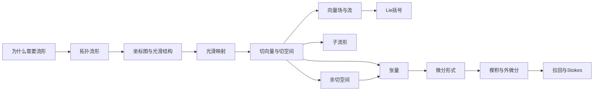

# 流形与微分几何 MOC

## 核心学习主线

```mermaid
flowchart LR
    A[为什么需要流形] --> B[拓扑流形]
    B --> C[坐标图与光滑结构]
    C --> D[光滑映射]
    D --> E[切向量与切空间]
    E --> F[向量场与流]
    F --> G[Lie括号]
    E --> H[子流形]
    E --> I[余切空间]
    E --> J[张量]
    I --> J
    J --> K[微分形式]
    K --> L[楔积与外微分]
    L --> M[拉回与Stokes]
```

> [!note]
> 下方“按需查阅”中的页面不是统一的前置阶段。沿主线阅读时，只有遇到陌生概念或需要更多细节，才跳转补充。

## 图示导航

- [[图示导航]]：全库图片入口和项目级图示原则
- [[流形学习示意图规划]]：流形专题图的优先级、文件名和制作状态

## 按需查阅：基础对象与工具

### 欧氏空间、约束和典型例子

- [[20 Concepts/00 Foundations/欧氏空间与欧氏坐标|欧氏空间与欧氏坐标]]
- [[20 Concepts/00 Foundations/约束变量与状态空间|约束变量与状态空间]]
- [[20 Concepts/02 Geometry and Topology/圆周 S1|圆周 S1]]
- [[20 Concepts/02 Geometry and Topology/球面 S2|球面 S2]]
- [[20 Concepts/02 Geometry and Topology/特殊正交群 SO3|特殊正交群 SO3]]

### 常用数学语言

- [[20 Concepts/00 Foundations/映射、复合与原像|映射、复合与原像]]
- [[20 Concepts/00 Foundations/向量空间与线性映射|向量空间与线性映射]]
- [[20 Concepts/00 Foundations/对偶空间|对偶空间]]
- [[20 Concepts/00 Foundations/多元链式法则与Jacobian|多元链式法则与Jacobian]]

### 拓扑预备

- [[20 Concepts/01 Topology/拓扑|拓扑]]
- [[20 Concepts/01 Topology/拓扑空间与开集|拓扑空间与开集]]
- [[20 Concepts/01 Topology/开集、连续与同胚|开集、连续与同胚]]
- [[20 Concepts/01 Topology/子空间拓扑|子空间拓扑]]
- [[20 Concepts/01 Topology/Hausdorff 条件|Hausdorff 条件]]
- [[20 Concepts/01 Topology/拓扑基与第二可数|拓扑基与第二可数]]

## 1. 动机与流形结构

- [[20 Concepts/02 Geometry and Topology/为什么需要流形|为什么需要流形]]
- [[20 Concepts/02 Geometry and Topology/拓扑流形|拓扑流形]]
- [[20 Concepts/02 Geometry and Topology/坐标图、图册与坐标转换|坐标图、图册与坐标转换]]
- [[20 Concepts/02 Geometry and Topology/圆与球面的坐标图|圆与球面的坐标图]]
- [[20 Concepts/02 Geometry and Topology/光滑流形|光滑流形]]
- [[20 Concepts/02 Geometry and Topology/光滑映射与微分同胚|光滑映射与微分同胚]]

## 2. 切空间、映射与子流形

- [[20 Concepts/02 Geometry and Topology/切向量|切向量]]
- [[20 Concepts/02 Geometry and Topology/切空间|切空间]]
- [[20 Concepts/02 Geometry and Topology/切丛|切丛]]
- [[20 Concepts/02 Geometry and Topology/推前与拉回|推前与拉回]]
- [[20 Concepts/02 Geometry and Topology/浸入、淹没与嵌入|浸入、淹没与嵌入]]
- [[20 Concepts/02 Geometry and Topology/子流形与正则值定理|子流形与正则值定理]]

## 3. 向量场

- [[20 Concepts/02 Geometry and Topology/向量场|向量场]]
- [[20 Concepts/02 Geometry and Topology/向量场的流|向量场的流]]
- [[20 Concepts/02 Geometry and Topology/Lie括号|Lie括号]]

## 4. 余切、张量与微分形式

- [[20 Concepts/02 Geometry and Topology/余切空间|余切空间]]
- [[20 Concepts/02 Geometry and Topology/余切丛|余切丛]]
- [[20 Concepts/02 Geometry and Topology/微分与梯度|微分与梯度]]
- [[20 Concepts/02 Geometry and Topology/张量与张量场|张量与张量场]]
- [[20 Concepts/02 Geometry and Topology/交替张量与微分形式|交替张量与微分形式]]
- [[20 Concepts/02 Geometry and Topology/楔积|楔积]]
- [[20 Concepts/02 Geometry and Topology/外微分|外微分]]
- [[20 Concepts/02 Geometry and Topology/微分形式的拉回|微分形式的拉回]]
- [[20 Concepts/02 Geometry and Topology/流形上的积分与Stokes定理|流形上的积分与Stokes定理]]

## 5. 后续结构

待展开：

- 黎曼度规与体积形式
- 联络与协变导数
- 平行移动与测地线
- 曲率
- 分割统一
- de Rham 上同调
- 李群与李代数
- 辛几何

## 6. 力学与数值应用

- [[20 Concepts/03 Mathematical Physics/勒让德映射与切丛余切丛|勒让德映射与切丛余切丛]]
- 约束动力系统
- 流形优化
- 李群积分
- 曲面 PDE
- 几何守恒律

## 练习

- [[50 Exercises/前置知识练习|前置知识练习]]
- [[50 Exercises/切空间与余切空间练习|切空间与余切空间练习]]
- [[50 Exercises/流形基础与微分形式练习|流形基础与微分形式练习]]

## 关键问题

- [[40 Questions/为什么需要流形而不只使用约束方程|为什么需要流形而不只使用约束方程]]
- [[40 Questions/为什么切向量与余切向量必须区分|为什么切向量与余切向量必须区分]]
- [[40 Questions/为什么不同点的切向量不能直接相减|为什么不同点的切向量不能直接相减]]
- [[40 Questions/为什么微分天然属于余切空间|为什么微分天然属于余切空间]]
- [[40 Questions/为什么Lie括号不能只由单点向量决定|为什么Lie括号不能只由单点向量决定]]
- [[40 Questions/为什么微分形式适合积分|为什么微分形式适合积分]]
